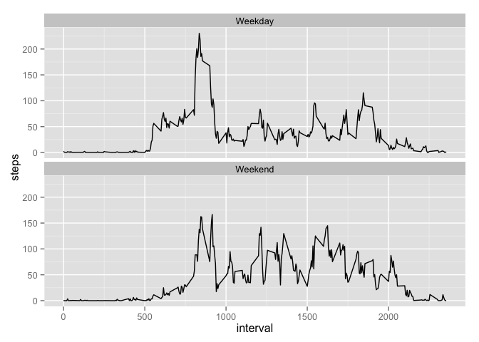

# Reproducible Research: Peer Assessment 1


## Loading and preprocessing the data

This code loads the data from working directory as cloned from Github and reviews the 
content using the str function. It converts the date field to date lass and reviews
content again using the summary funtion. We notice there is a large amount of missing step values.


```r
data <- read.csv("activity.csv", header = TRUE)
str(data)
```

```
## 'data.frame':	17568 obs. of  3 variables:
##  $ steps   : int  NA NA NA NA NA NA NA NA NA NA ...
##  $ date    : Factor w/ 61 levels "2012-10-01","2012-10-02",..: 1 1 1 1 1 1 1 1 1 1 ...
##  $ interval: int  0 5 10 15 20 25 30 35 40 45 ...
```

```r
data$date <- as.Date(data$date)
summary(data)
```

```
##      steps            date               interval   
##  Min.   :  0.0   Min.   :2012-10-01   Min.   :   0  
##  1st Qu.:  0.0   1st Qu.:2012-10-16   1st Qu.: 589  
##  Median :  0.0   Median :2012-10-31   Median :1178  
##  Mean   : 37.4   Mean   :2012-10-31   Mean   :1178  
##  3rd Qu.: 12.0   3rd Qu.:2012-11-15   3rd Qu.:1766  
##  Max.   :806.0   Max.   :2012-11-30   Max.   :2355  
##  NA's   :2304
```

## Make a histogram of total number of steps taken per day

To see the distribution of steps taken across all days we load the plyr package and summarise steps while ignoring missing values to create a Steps per Day (SpD) dataframe. 


```r
library(plyr)
SpD <- ddply(data, ~date, summarise, Steps = sum(steps, na.rm = TRUE))
hist(SpD$Steps)
```

 

Plotting the data on a histogram we notice the distribution seems skewed and suspect it's because missing step values have been taken as 0.

## What is mean total number of steps taken per day?

Using the dataframe created in the previous step we calculate the mean and median of steps taken across all days using the summary function.  


```r
summary(SpD)
```

```
##       date                Steps      
##  Min.   :2012-10-01   Min.   :    0  
##  1st Qu.:2012-10-16   1st Qu.: 6778  
##  Median :2012-10-31   Median :10395  
##  Mean   :2012-10-31   Mean   : 9354  
##  3rd Qu.:2012-11-15   3rd Qu.:12811  
##  Max.   :2012-11-30   Max.   :21194
```


## What is the average daily activity pattern?

To see the average daily activity pattern we use the plyr package again to average the number of steps taken per 5 minute interval across all days and create a new dataframe called SpI. Again we ignore all missing step values. We plot the new data to visualise. and use the max funtion to determine which interval has the highest value


```r
SpI <- ddply(data, ~interval, summarise, avgSteps = mean(steps, na.rm = TRUE))
plot(SpI$interval,SpI$avgSteps,type="n")
lines(SpI$interval,SpI$avgSteps,type="l")
```

 

## Which 5 minute interval on average has the highest number of steps

To calculate this we use the subset function on the newly created SpI dataframe


```r
subset(SpI, SpI$avgSteps == max(SpI$avgSteps))
```

```
##     interval avgSteps
## 104      835    206.2
```

## Imputing missing values

We noticed in the first step there are a large amount of observations with missing step values. To deal with this we'll impute missing values by assigning the average across all days to intervals with NAs. We'll merge the original dataset with the new SpI frame and loop through the new data assigning the average where a value is missing. We'll explore the new set using by plotting a histogram and using the summary function to see new median and mean.


```r
data_complete <- join(data, SpI, by = "interval")
summary(data_complete)
```

```
##      steps            date               interval       avgSteps     
##  Min.   :  0.0   Min.   :2012-10-01   Min.   :   0   Min.   :  0.00  
##  1st Qu.:  0.0   1st Qu.:2012-10-16   1st Qu.: 589   1st Qu.:  2.49  
##  Median :  0.0   Median :2012-10-31   Median :1178   Median : 34.11  
##  Mean   : 37.4   Mean   :2012-10-31   Mean   :1178   Mean   : 37.38  
##  3rd Qu.: 12.0   3rd Qu.:2012-11-15   3rd Qu.:1766   3rd Qu.: 52.83  
##  Max.   :806.0   Max.   :2012-11-30   Max.   :2355   Max.   :206.17  
##  NA's   :2304
```

```r
for (i in 1:nrow(data_complete)){
        if(is.na(data_complete[i,1])) {
                        data_complete[i,1] <- data_complete[i,4]
                }
        }
data_complete <- data_complete[,-4]

SpDC <- ddply(data_complete, ~date, summarise, Steps = sum(steps))
hist(SpDC$Steps)
```

 

```r
summary(SpDC)
```

```
##       date                Steps      
##  Min.   :2012-10-01   Min.   :   41  
##  1st Qu.:2012-10-16   1st Qu.: 9819  
##  Median :2012-10-31   Median :10766  
##  Mean   :2012-10-31   Mean   :10766  
##  3rd Qu.:2012-11-15   3rd Qu.:12811  
##  Max.   :2012-11-30   Max.   :21194
```


## Are there differences in activity patterns between weekdays and weekends?
Using the new complete data set we group observations into weekdays and weekends. We then calculate a new average per interval across these two day factors using the plyr package. We plot these next to each other to compare activity and see that weekdays have active mornings while weekends has elevated activity throughout the day.


```r
data_complete$day <- weekdays(as.Date(data_complete$date))

for (i in 1:nrow(data_complete)){
        if(data_complete[i,4] %in% c("Sunday", "Saturday")) {
                data_complete[i,4] <- "Weekend"} else {
                        data_complete[i,4] <- "Weekday"
                }
        }

data_complete$day <- factor(data_complete$day)
SpDCavg <- ddply(data_complete, ~day + interval, summarise, steps = mean(steps))

library(ggplot2)
ggplot(SpDCavg, aes(interval,steps)) + geom_line() + facet_wrap(~day, nrow = 2)
```

 


